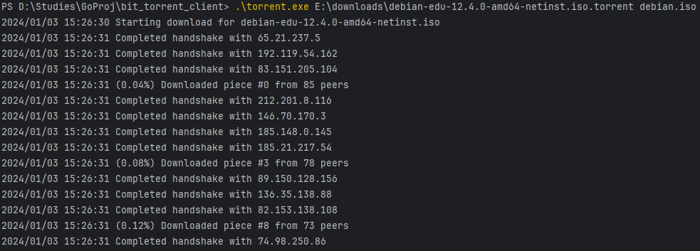

# bit_torrent_client

_Tiny BitTorrent client written in Go_

## Install

```shell
go get github.com/Pavelavl/bit_torrent_client
```

## Build
```shell
go build -o torrent.exe .\main.go
```

## Usage
After building the application, you can try: 



## Limitations
* Only supports `.torrent` files (no magnet links)
* Only supports HTTP trackers
* Does not support multi-file torrents
* Strictly leeches (does not support uploading pieces)
